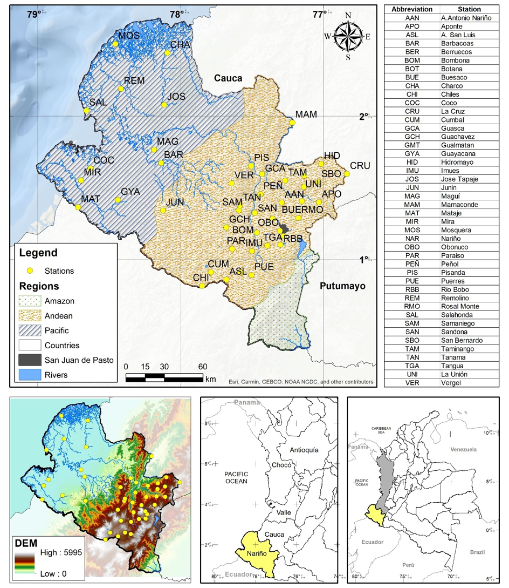
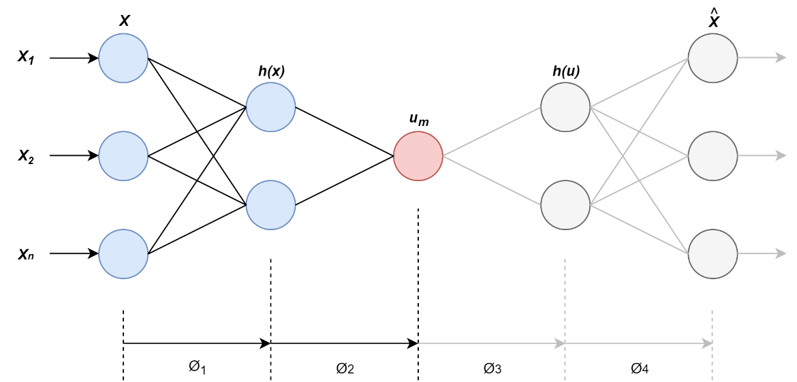
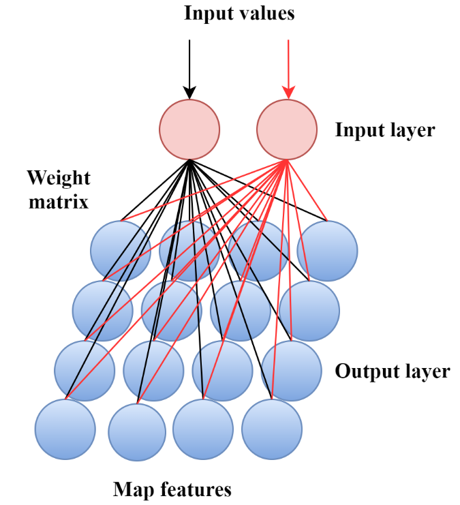

# NLPCA-SOM
Clustering using Self-Organizing Maps through Non-Linear Principal Components Analysis - Rainfalls in Southwestern Colombia

## Abstract

The knowledge of rainfall regimes is a prerequisite necessary for many activities such as water resources management, mitigation of risks, planning of socioeconomic activities and other hydrologic applications. In this paper, the use of non-linear principal component analysis (NLPCA) and self-organized feature map (SOM), as non-linear techniques are applied to identify the homogenous regions for monthly rainfall in the southwestern of Colombia. SOM was applied to a network of 44 monthly rainfall gauge stations represent in five principal components using NLPCA. The NLPCA coefficients represent the dimension reduction in the period from January of 1983 to December of 2016 into five principal components for each gauge station. The two-dimensional SOM indicates that rainfall gauges can be grouped into two clusters. A heterogeneity test showed that the two regions are acceptably homogeneous and depict the main features of the monthly rainfall variability over the study area. Besides, both identified clusters show two types of rainfall regime: bimodal in the Andean Region and unimodal in the Pacific Region. The bimodal regimes predominate in the mountainous area and the unimodal regime over the coastal zone. The application of SOM provided a better understanding of the seasonality and spatiality of rainfall.
The advantages of NLPCA and SOM are three points:
-	The application of NLPCA allows the reduction of dimensions and extraction of the main features of rainfall datasets.
-	SOM is an artificial neural network useful for the classification and identification of homogeneous climate zones.
-	The combination of NLPCA and SOM is an efficient approach for the classification of monthly rainfall in southwestern Colombia.

## Data
The dataset of monthly rainfall used in this study was obtained from 44-gauge stations located in different zones in the Southwestern Colombia (Nariño) (<a href='#GeoLo'>Fig. 1</a>), available in Canchala et al [1]. The time series analyzed covers 34 years of observation between 1983 and 2016.

<caption><b> Figure 1. Geographic location of the study area and distribution of rainfall stations</b> </caption>

## Method
The methodology proposed in this study was developed according to the flowchart presented in <a href='#Method'>Fig. 2</a>. The regionalization of monthly rainfall was performed using two nonlinear techniques: NLPCA and SOM. NLPCA was used to reduce the dimensionality of the dataset, and SOM to identify regions with homogeneous rainfall.

<caption><b> Figure 2. Flowchart of methodology</b> </caption>

### Non-Linear principal component analysis (NLPCA) 
NLPCA operates by training a feed-forward neural network to perform the identity mapping, where the network inputs are reproduced at the output layer. The network contains an internal "bottleneck" layer that allows generating a compact representation of the input data. This technique successfully reduces the dimensionality and create a feature space map similar to the actual distribution of the underlying system parameters [37]. The scheme of NLPCA is shown in <a href='#nlpca'>Fig. 3</a>. In this, the dimensions of  and  are  and , respectively, where  is the input column vector of length , and  is the number of hidden neurons in the encoding and decoding layers for . The neurons  is calculated from a linear combination of hidden neurons . A second transfer function  maps the encoding layer to the bottleneck layer containing a single neuron.

<caption><b> Figure 3. NN Model for calculating NLPCA</b> </caption>

In this study, the input data were 44-gauge stations with temporal series of 408 months (34 years), NLPCA was used to reduce the temporal dimensionality of the dataset to five NLPC’s using a network with a [408-200-25-5] topology. In Appendix A, we provide the code in Matlab and a brief explanation of the basic steps that are necessary to generate the reduction of dimensions (five NLPC’s) of the monthly rainfall dataset. 

### Self-Organizing Map (SOM) 
Five NLPC’s coefficients were estimated to represent the dimension reduction in the period from January of 1983 to December of 2016 for each gauge station and this were used as inputs of SOM to capture a profile of the homogeneous areas and to obtain a classification of the gauge stations. SOM approximates the probability density function of the input data by an unsupervised learning algorithm, with properties of neighborhood preservation and local resolution of the input space proportional to the data distribution [41, 42].  The algorithm allows the clustering, visualization, and abstraction of complex data. SOM is composed of two layers: an input layer formed by a set of nodes, and an output layer composite by nodes ordered in a two-dimensional grid (<a href='#som'>Fig. 4</a>) [43]. Each node in the input layer is joined to all the nodes in the output layer by synaptic links. Each output node has a weight vector W (connection intensity) associated with the input data, which establishes a relationship between the feature vector and the cluster of feature vectors [31]. In this study, the input values of SOM are the five NLPC’s obtained in the NLPCA, and in the output layer a total of 25 nodes were considered (grid of 5x5 cells) to provide improved visualization.

<caption><b> Figure 4. SOM two-level architecture</b> </caption>

### Method validation
The validation of the regions identified in the cluster analysis with NLPCA and SOM was performed through heterogeneity measure (H) developed by Hosking and Wallis [44], where , indicates the region is considered "acceptably homogeneous";  indicates the region is claimed "possibly heterogeneous"; and region with  2"> is "definitely heterogeneous". Furthermore, a spatial validation was performed, verifying the spatial coherence of each gauge station classified in each cluster, to finally analyze the seasonality of monthly rainfall in southwestern Colombia (Nariño).

## MatLab Files
Follow the next instructions to get similar results as we present in [Paper].

### Requirements
First, run <a href='Requirements.m'><b>Requirements.m</b></a> to check if your MatLab version is compatible to run scripts and functions. Verify using this script or doing the next checklist:
- [x] MatLab realease 2015b
- [x] Neural Network Toolbox

If you run the script a message dialog will appear to inform if your version is compatible or not (Check flag value, if this is zero then the Main_Script.m will not work).

### Main_Script
This is the main script where, it is possible to reply the results from the manuscript [Paper]. Click <a href='Main_Script.m'>here</a> to check the full script.
We develop an autoenconder using a network with a [408-200-25-5] topology. Were 408 is the number of inputs (series time for each gauge station), after is reduced layer by layer until it achieves only five outputs. The main idea is verify that per each training stage the performance is well reduced to thrust in the model.
If you execute step by step the <a href='Main_Script.m'><b>Main_Script.m</b></a> some views are presented in <a href='#enc01'>Fig. 5</a>, <a href='#enc02'>Fig. 6</a>, and <a href='#enc03'>Fig. 7</a>.

<caption><b> Figure 5. First stage to train an autoenconder [408-200-408] </b> </caption>

<caption><b> Figure 6. Second stage to train an autoenconder [200-25-200] </b> </caption>

<caption><b> Figure 7. Third stage to train an autoenconder [25-5-25] </b> </caption>

When all encoders are trained, then they are stacked in just one architecture, which is used to generate five non-linear principal components. These are finally used to create a Self-Organizing Map (SOM) to verify if these components represent well defined clusters for the classification of monthly rainfall in southwestern Colombia. One of the possible results after generating several SOM training is presented in <a href='#fullenc'>Fig. 8</a>.

<caption><b> Figure 8. Encoder [408-200-25-5] </b> </caption>

The script also include a function called <a href='SOM_ClusterDefinition.m'><b>SOM_ClusterDefinition.m</b></a> to draw the result of the SOM with different colors if clusters are found. Threshold value defines how split neurons based on the intra-cluster distance; if inactive neurons are found between groups of active neurons, and they help to define an isolated group then a cluster could be defined.
