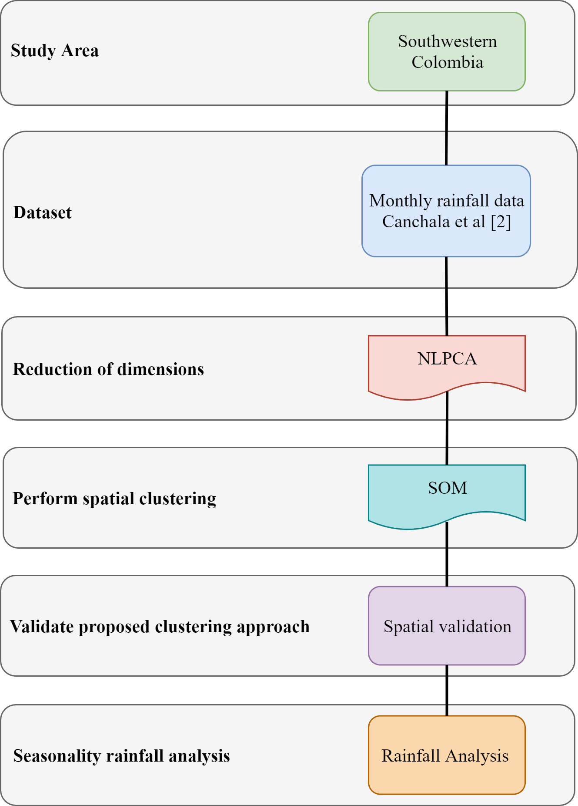

# NLPCA-SOM
Clustering using Self-Organizing Maps through Non-Linear Principal Components Analysis - Rainfalls in Southwestern Colombia.

This **GitHub** is part of the article titled: **"Regionalization of monthly rainfall in southwestern Colombia using neural networks"** (See [[1]](#1)). In case to use these code, please refer as:
- Canchala, Teresita; Carvajal-Escobar, Yesid; Alfonso-Morales, Wilfredo; Loaiza, Wilmar; Caicedo, Eduardo; Regionalization of monthly rainfall in southwestern Colombia using neural networks. MethodsX. 2020.

## Abstract

The knowledge of rainfall regimes is a prerequisite necessary for many activities such as water resources management, mitigation of risks, planning of socioeconomic activities, and other hydrologic applications. In this paper, non-linear principal component analysis (NLPCA) and self-organized feature map (SOM), as non-linear techniques, are applied to identify the homogenous regions for monthly rainfall in the southwestern of Colombia. SOM uses data from a network of 44 monthly rainfall gauge stations represent in five principal components using NLPCA. The components represent the dimension reduction in the period from January of 1983 to December of 2016 into five principal components for each gauge station. The two-dimensional SOM indicates that two clusters grouped all rainfall gauges. A heterogeneity test showed that the two regions are acceptably homogeneous and depict the main features of the monthly rainfall variability over the study area. Besides, both identified clusters show two types of rainfall regimes: bimodal in the Andean Region and unimodal in the Pacific Region. The bimodal predominates in the mountainous area and the unimodal over the coastal zone. The application of SOM provided a better understanding of the seasonality and spatiality of rainfall.
The advantages of NLPCA and SOM are three points:
-    The application of NLPCA allows the reduction of dimensions and extraction of the main features of rainfall datasets.
-    SOM is an artificial neural network useful for the classification and identification of homogeneous climate zones.
-    The combination of NLPCA and SOM is an efficient approach for the classification of monthly rainfall in southwestern Colombia.

## Data
The dataset of monthly rainfall used in this study was obtained from 44-gauge stations located in different zones in the Southwestern Colombia (Nariño) (<a href='#GeoLo'>Fig. 1</a>), available in Canchala et al. [[2]](#2). The time series analyzed covers 34 years of observation between 1983 and 2016.

<caption><b> Figure 1. Geographic location of the study area and distribution of rainfall stations</b> </caption>

## Method
The methodology proposed in this study was developed according to the flowchart presented in <a href='#Method'>Fig. 2</a>. The regionalization of monthly rainfall was performed using two nonlinear techniques: NLPCA and SOM. NLPCA was used to reduce the dimensionality of the dataset, and SOM to identify regions with homogeneous rainfall.

<caption><b> Figure 2. Flowchart of methodology</b> </caption>

### Non-Linear Principal Component Analysis (NLPCA) 
NLPCA operates by training a feed-forward neural network to perform the identity mapping, where the network inputs are reproduced at the output layer. The network contains an internal "bottleneck" layer that allows generating a compact representation of the input data. This technique successfully reduces the dimensionality and create a feature space map similar to the actual distribution of the underlying system parameters [[3]](#3). The scheme of NLPCA is shown in <a href='#nlpca'>Fig. 3</a>. In this, the dimensions of  and  are  and , respectively, where  is the input column vector of length , and  is the number of hidden neurons in the encoding and decoding layers for . The neurons  is calculated from a linear combination of hidden neurons . A second transfer function  maps the encoding layer to the bottleneck layer containing a single neuron.

<caption><b> Figure 3. NN Model for calculating NLPCA</b> </caption>

In this study, the input data were 44-gauge stations with temporal series of 408 months (34 years), NLPCA was used to reduce the temporal dimensionality of the dataset to five non-linear components using a network with a [408-200-25-5] topology. 

### Self-Organizing Map (SOM) 
Five non-linear coefficients were estimated to represent the dimension reduction in the period from January of 1983 to December of 2016 for each gauge station, and this was used as inputs of SOM to capture a profile of the homogeneous areas and to obtain a classification of the gauge stations. SOM approximates the probability density function of the input data by an unsupervised learning algorithm, with properties of neighborhood preservation and local resolution of the input space proportional to the data distribution [[4](#4), [5](#5)].  The algorithm allows the clustering, visualization, and abstraction of complex data. SOM is composed of two layers: an input layer formed by a set of nodes, and an output layer composite by nodes ordered in a two-dimensional grid (<a href = '#som'>Fig. 4</a>) [[6]](#6). Each node in the input layer is joined to all the nodes in the output layer by synaptic links. Each output node has a weight vector W (connection intensity) associated with the input data, which establishes a relationship between the feature vector and the cluster of feature vectors [[7]](#7). In this study, the input values of SOM are the five non-linear principal components obtained in the NLPCA, and the output layer, with a total of 25 neurons (grid of 5x5 cells) to provide improved visualization.

<caption><b> Figure 4. SOM two-level architecture</b> </caption>

<!-- ### Method validation -->
<!-- The validation of the regions identified in the cluster analysis with NLPCA and SOM was performed through heterogeneity measure (H) developed by Hosking and Wallis [44], where , indicates the region is considered "acceptably homogeneous";  indicates the region is claimed "possibly heterogeneous"; and region with  2"> is "definitely heterogeneous". Furthermore, a spatial validation was performed, verifying the spatial coherence of each gauge station classified in each cluster, to finally analyze the seasonality of monthly rainfall in southwestern Colombia (Nariño). -->

## MatLab Files
Follow the next instructions to get similar results as we present in [[1]](#1).

### Requirements.m
First, run <a href='Requirements.m'><b>Requirements.m</b></a> to check if your MatLab version is compatible to run scripts and functions. Verify using this script or doing the next checklist:
- [x] MatLab realease 2015b
- [x] Neural Network Toolbox

If you run the script a message dialog will appear to inform if your version is compatible or not (Check flag value, if this is zero then the <a href='Main_Script.m'><b>Main_Script.m</b></a> will not work).

### Main_Script.m
This is the main script where, it is possible to reply the results from the manuscript [[1]](#1). Click <a href='Main_Script.m'>here</a> to check the full script.
We develop an autoencoder using a network with a [408-200-25-5] topology. Where 408 is the number of inputs (series time for each gauge station) after the inputs are reduced layer by layer until it achieves only five outputs. The main idea is verifying that per each training stage, the performance improves to thrust in the model.
If you execute step by step the <a href='Main_Script.m'><b>Main_Script.m</b></a> some views are presented in <a href='#enc01'>Fig. 5</a>, <a href='#enc02'>Fig. 6</a>, and <a href='#enc03'>Fig. 7</a>.

<caption><b> Figure 5. First stage to train an autoenconder [408-200-408] </b> </caption>

<caption><b> Figure 6. Second stage to train an autoenconder [200-25-200] </b> </caption>

<caption><b> Figure 7. Third stage to train an autoenconder [25-5-25] </b> </caption>

When all encoders are trained, then they are stacked in just one architecture, which is used to generate five non-linear principal components. These are finally used to create a Self-Organizing Map (SOM) to verify if these components represent well defined clusters for the classification of monthly rainfall in southwestern Colombia. One of the possible results after generating several SOM training is presented in <a href='#fullenc'>Fig. 8</a>.

<caption><b> Figure 8. Encoder [408-200-25-5] </b> </caption>

The script also include a function called <a href='SOM_ClusterDefinition.m'><b>SOM_ClusterDefinition.m</b></a> to draw the result of the SOM with different colors if clusters are found. Threshold value defines how split neurons based on the intra-cluster distance; if inactive neurons are found between groups of active neurons, and they help to define an isolated group then a cluster could be defined.

### Paper_Result.m
<a href='Paper_Result.m'><b>Paper_Result.m</b></a> calls the values saved to show in [[1]](#1). It calls the trained data from **example** folder; data are the result from NLPCA training using [408-200-25-5] encoder topology. <a href='#result'>Fig. 9</a> shows the results from trained data.

<caption><b> Figure 9. Classification result based on saved information </b> </caption>

<!--- To demonstrate whether proposed regions in the cluster analysis can be accepted as homogeneous features, a heterogeneity test developed by Hosking and Wallis [44] was used. The results of heterogeneity tests show that AR and PR are "acceptably homogeneous", with  (see <a href='#table01'>Table 1</a>) allowing to confirm that both clusters areensidered as homogeneous regions.-->

<!-- 
<caption id='table01'><b> Table 1. Results of heterogeneity test for the two clusters obtained by the SOM. </b> </caption>
-->

<!-- |Cluster    | Number of gauges    | Gauge stations    | Heterogeneity Measure H |-->
<!-- | :---: | :---: | --- | :---: |-->
<!-- | AR    | 33    | VER, BOM, BOT, BUE, CHI, CUM, PAR, PEÑ, GCH, GMT, HID, IMU, JUN, GCA, UNI, MAM, NAR, OBO, PIS, PUE, RBB, RMO, SAM, SBO, SAN, TAM, TAN, TGA, CRU, ASL, AAN, APO, VER.    | -0.86 |-->
<!-- | PR    | 11    | BAR, MIR, CHA, MAT, MOS, REM, SAL, JOS, MAG, GYA, COC    | 0.21 |-->

Finally, the results were validated verifying the geographic coherence of the location of the 44 gauge stations in the department of Nariño, as shown in <a href='RegionalizationResult'>Fig. 10</a>. The spatial location makes it possible to verify that the 33 gauge stations of the AR are located over the mountain range (Colombian massif) and that the 11 gauge stations of PR are located over the Nariño coast (Colombian Chocó biogeographic).

<caption><b> Figure 10. Regionalization of monthly rainfall in Nariño using CPNL and SOM </b> </caption>

## References
<a id='1'>[1]</a> T. Canchala, Y. Carvajal, W. Alfonso, W. Loaiza, and E. Caicedo. "Regionalization of monthly rainfall in southwestern Colombia using neural networks." MethodsX. 2020.

<a id='2'>[2]</a> T. Canchala, Y. Carvajal, W. Alfonso, W. Loaiza, and E. Caicedo. "Estimation of missing data of monthly rainfall in southwestern Colombia using artificial neural networks."  Data in Brief, Vol. 26, pp. 104517. October 2019. [https://doi.org/10.1016/j.dib.2019.104517](https://doi.org/10.1016/j.dib.2019.104517)

<a id ='3'>[3]</a> M. A. Kramer. "Non-linear principal component analysis using auto-associative neural networks." AIChE Journal, vol. 37, pp. 233-243, 1991. [https://doi.org/10.1002/aic.690370209](https://doi.org/10.1002/aic.690370209)

<a id='4'>[4]</a> T. Kohonen. "Self-Organizing Maps." Information Sciences. Berlin: Springer, vol. 30, 2001.

<a id='5'>[5]</a> T. Kohonen. "Self-organized formation of topologically correct feature maps." Biological cybernetics, vol. 43, pp. 59-69, 1982. [https://doi.org/10.1007/BF00337288](https://doi.org/10.1007/BF00337288)

<a id='6'>[6]</a> K.-C. Hsu and S.-T. Li. "Clustering spatial-temporal precipitation data using wavelet transform and self-organizing map neural network." Advances in Water Resources, vol. 33, pp. 190-400,42010. [https://doi.org/10.1016/j.advwatres.2009.11.005](https://doi.org/10.1016/j.advwatres.2009.11.005)

<a id='7'>[7]</a> F. Farsadnia, M.R. Kamrood, A.M. Nia, R. Modarres, M.T. Bray, and D. Han. "Identification of homogeneous regions for regionalization of watersheds by two-level self-organizing feature maps." Journal of hydrology, vol. 509, pp. 387-397, 2014. [https://doi.org/10.1016/j.jhydrol.2013.11.050](https://doi.org/10.1016/j.jhydrol.2013.11.050)
